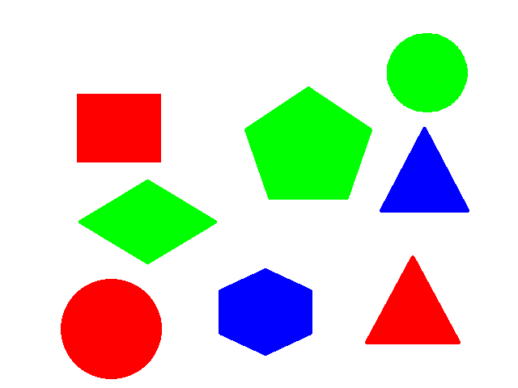
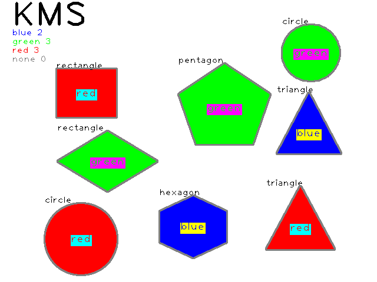

# IntelEdgeAISW 7기 8월 6일 OpenCV평가 문제

## - OpenCV를 활용한 도형 검출 및 색상 분류

1. 도형이미지를 입력 받아 도형 이름과 색상 정보를 검출 하여 출력 이미지로 저장

2. 주요 사용 함수는 `threshold()`, `morphologyEx()`, `findContours()`, `approxPolyDP()`, `drawContours()`, 색상 정보는 HSV색상테이블 `cvColor()`, 관심영역 색상평균 `mean()`, `putText()`

3. 색상 정보는 아래 구조체를 사용하여 색상 카운터를 하고, 도형 중앙에 출력하는 `etColorLabel()`함수를 작성하여 출력
```c
struct colorInfoStruct
{
    String name;
    Scalar color;
    int count;
};
```
```c
colorInfoStruct colorInfo[4] = {
    {"blue", Scalar(255, 0, 0), 0},
    {"green", Scalar(0, 255, 0), 0},
    {"red", Scalar(0, 0, 255), 0},
    {"none", Scalar(128, 128, 128), 0}};
```

4. 출력 이미지 좌측 상단에는 작성자 이름 및 색상별 카운트수를 `putText()`로 표시
```c
for (int i = 0; i < (sizeof(colorInfo) / sizeof(colorInfo[0])); i++)
{
    String strText = colorInfo[i].name + " " + to_string(colorInfo[i].count);
    putText(img, strText, Point(20, 60 + (15 * i)), FONT_HERSHEY_PLAIN, 1, colorInfo[i].color, 1);
}
```

5. 실행 결과는 아래 이미지와 동일하게 구현

- 입력 이미지(640x480_shape.png)


- 출력 이미지(KMS.png)
